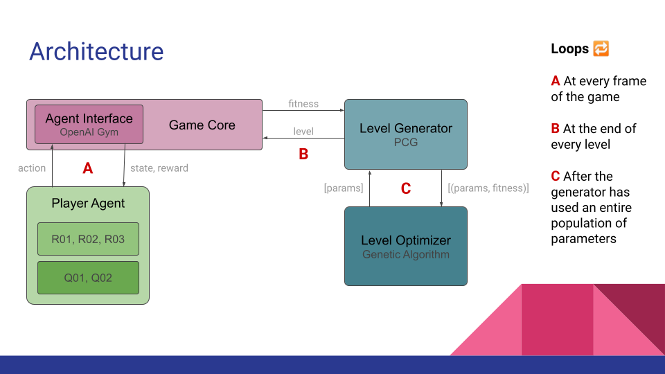

# Roguelife 💀
The game that both plays and develops itself

More elaborated, this project is about pitting AI agents against a procedural level generator. The level generator will adapt to the player over time. For illustration purposes, we have designed some rule-based agents who use very specific strategies, to see how the generator "responds" to that. For the full experiment, we want to run a learning agent (using a DQN), that will learn to exploit the environment, all while the environment learns to exploit the agent.

## Authors
- Jonathan Jørgensen
- Pedro M. Fernandes
- Even Klemsdal 
- Niels NTG Poldervaart

## Architecture

## Dependencies
```
pygame
numpy
gym
pillow
scipy
stable_baselines3
```
## Video

[Training Montage](https://drive.google.com/file/d/1-C4bBehG-3zYwyCrGEYSs35uZPIEWhg0/view)
